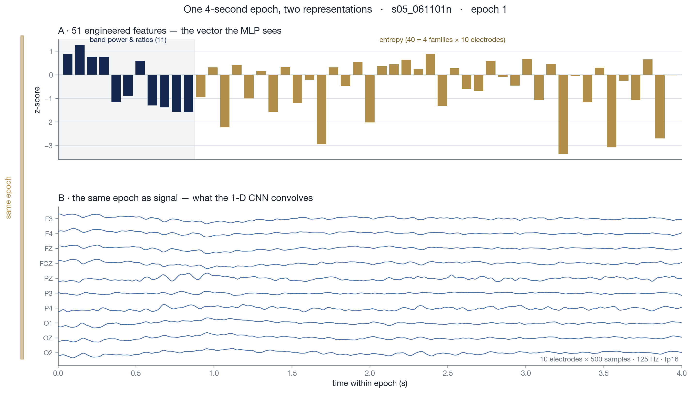
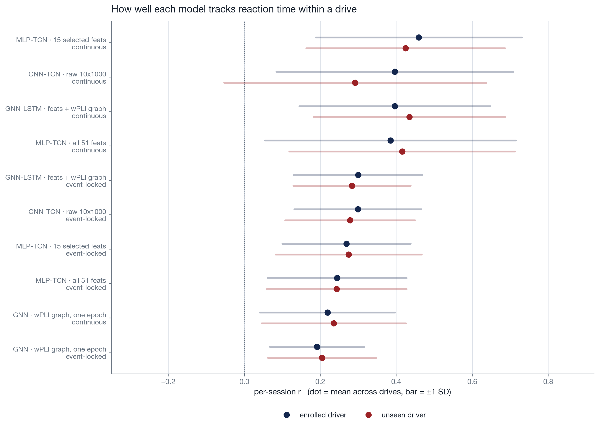
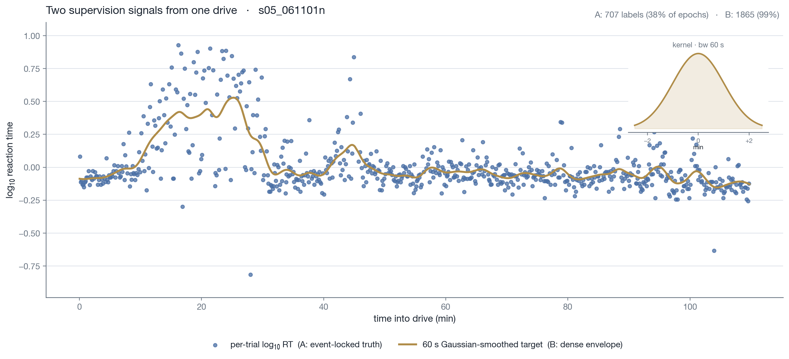
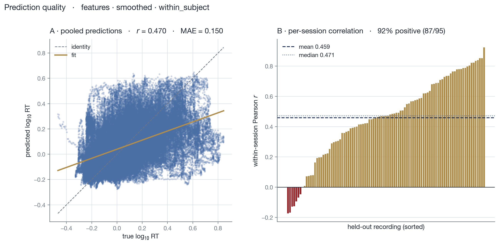
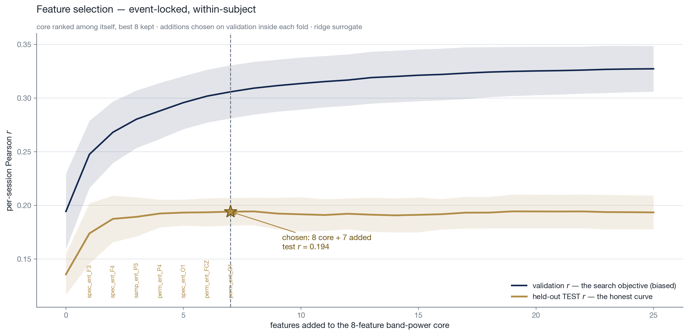

# Predicting how fast a driver will react, from their brain activity

**Could a simple 10 electrodes EEG headset predict/track a driver's reaction time before lane deviations?**

This project answers that with three neural network architectures on a public driving dataset, and
finds that the smallest of them wins. A 117k-parameter temporal convolutional network outperforms a
374k-parameter graph neural network with LSTM, and fifteen carefully chosen features beat both the full
51-feature set and the raw brain signal.

---

## The problem

Twenty-seven people drove a simulator for about 90 minutes each. Every so often the car drifted out of
its lane, and they steered it back. How long they took to react, a few hundred milliseconds when
alert, several seconds when drowsy, is the thing to predict. Ten electrodes on the scalp recorded
brain activity throughout.

This is harder than it sounds, for three reasons.

**Brains differ.** The same mental state looks different on two people, and even on the same person
on two days. Electrode positions shift, skin conductance changes, individual anatomy varies.

**Drowsiness is slow, reactions are fast.** Alertness drifts over minutes; a reaction takes under a
second. A model has to hold a long context to predict a brief event.

**Nothing should look into the future.** A system that warns a real driver only has the past, so a
preprocessing step that peeks ahead inflates the score without being deployable. 

It is hard enough that most driver-monitoring work avoids it. The common framing is
*detection* (classify a driver as drowsy or alert) which sidesteps the harder question of
predicting **how slow** the next response will be which would be crucial for a stimulating device. 
Predicting a continuous reaction time is the version attempted here, and published results show why it
is avoided: a 2025 paper on this exact dataset reports correlations of 0.21–0.26 between predicted and
actual reaction times [1].

The data is the [SADT driving dataset](https://doi.org/10.6084/m9.figshare.7666055) (Cao et al.,
2019) [2]: 62 recordings, 27 subjects, 30 electrodes at 500 Hz. Only the 10 theorized most useful 
electrodes for a cheap wearable headset are used here.

**Two deployment scenarios are tested separately.** In the first, the driver is *enrolled*: they
complete a calibration drive once, and the system is then used on later drives of theirs. This is
how a real product would work, and it is the headline protocol here. In the second, the model has
never seen the driver at all which is harder, and what the mentioned published work reports.

## What I built

Every four seconds of brain signal becomes one time step. From each, the pipeline extracts established
EEG features related to attention according to the literature: band powers, signal-complexity measures,
and how synchronised pairs of electrodes are. Three architectures then compete on identical inputs and 
data splits to determine the most capable DL architecture:

| | what it does | size |
|---|---|---|
| **MLP-TCN** | a small network over engineered features, feeding a causal convolutional stack | 117k |
| **CNN-TCN** | the same stack, but learning its own features from the raw waveform | 156k |
| **GNN-LSTM** | electrodes as a graph, connectivity as edges, read by a recurrent network | 374k |

The graph model came first and is the heavier, more fashionable design. The question was whether its
extra machinery earns its keep.



*The same four seconds of brain signal, twice: as the 51 engineered numbers one model reads, and as
the raw waveform the other convolves.*

## What I found

Both protocols, every configuration. **Enrolled** means the driver already has other drives in
training — the calibration scenario. **Unseen** means the model has never encountered that person.
Per-session *r* is the headline metric: it removes each drive's baseline and, like a live
monitor, asks, *is this driver slowing down right now?* Both columns are restricted to the same 19
subjects, since only those have enough recordings to be tested under the enrolled protocol.



*The dot is the mean across drives; the bar spans ±1 standard deviation, not a confidence interval,
which describes how precisely the mean is known rather than how much performance actually varies.
Full numbers including MAE and parameter counts are in `figures/results_table.csv`.*

**The small model wins.** MLP-TCN reaches **0.459** against the graph model's 0.396 with a third of
the parameters, and the gap survives a paired subject-by-subject test. The heavier spatio-temporal
architecture was not needed.

**Temporal context is the largest single effect.** Stripping the temporal half out of the graph
model so predicting from one four-second window instead of a sequence, costs **0.18 to 0.24**.
Nothing else in the study comes close. Reaction time is a slow state, not an instantaneous readout.

**Fewer features beat more.** Fifteen greedily selected features beat all 51 in three of the four
protocol-by-label combinations, and beat the raw waveform in all four. Selection only ever sees data
the model is not tested on.

**The continuous target wins for every architecture**, by 0.10–0.19. It labels 97% of epochs against
the event-locked target's 30%, so the network has roughly three times as much to learn from.



*The two targets over one drive. The scatter is each trial's measured reaction time — what the
event-locked target uses. The curve spreads those same measurements into a continuous signal,
labelling three times as many moments.*

**A control that sees no EEG scores about zero**, confirming the models read brain activity rather
than "drivers get worse as the hour wears on".

On enrolled drivers the MLP-TCN leads. On unseen drivers it and the GNN-LSTM are level (0.424 and
0.434), well inside the noise but the TCN reaches that with a third of the parameters.

### But the spread dwarfs the differences

Standard deviations run 0.12–0.35, wider than any gap between models. For the headline
configuration, 65% of drives fall within ±1 SD of the mean and 95% within ±2, close to normal, so
the SD is a fair summary rather than an artefact of outliers. Across the 95 drives:

| | share of drives |
|---|---|
| tracked well (r > 0.6) | **32%** |
| weak (r < 0.2) | 18% |
| no signal at all (r < 0) | **8%** |

A mean of 0.46 means the model tracks about a third of drives well and fails outright on roughly one
in twelve. That is the honest picture of what this predicts and what it does not.



*Predicted against true reaction time for the best configuration, with the spread of per-drive
correlations beside it.*

### Does it work for a driver it has never seen?

Both scenarios were run. Comparing the **same 19 subjects** under each, so the two are not measuring
different populations:

| labels | enrolled driver | unseen driver | drop |
|---|---|---|---|
| event-locked | 0.269 | **0.274** | none measurable |
| continuous target | 0.459 | **0.424** | 0.035 |

Transfer to an unseen driver costs almost nothing on the event-locked task and about 0.035 on the
continuous one — against a run-to-run noise of ±0.015.

That is a surprising result, and it has an explanation worth stating: each recording is normalised
against its own first five minutes. That choice was made so the pipeline stays deployable, but it
also strips out the amplitude and offset differences that usually make cross-subject transfer hard.
Normalisation removes roughly a third of what distinguishes people.

### How this compares to published work

Rahman et al. (2025) [1] tackle the same problem on the same dataset, testing on drivers never seen
in training, and report Pearson correlations of **0.21–0.26** with a best mean absolute error of
0.36 s against a 0.58 s baseline.

| | correlation | protocol | channels |
|---|---|---|---|
| Rahman et al. 2025 | 0.21 – 0.26 | unseen driver | 32 |
| this work, event-locked | **0.274** | **unseen driver** | **10** |
| this work, continuous target | **0.424** | **unseen driver** | **10** |

On the same protocol, with **a third of the electrodes**, the event-locked model reaches the top of
their reported range and the continuous-target model is well above it.

That said, the same caution applies to their numbers as to these. They report standard deviations of
0.10–0.19 around correlations of 0.21–0.26, spreads as large as the means themselves, and this
work's spreads are wider still, at 0.12–0.35. Both sets of results describe a task where the
variation between drivers and drives is larger than any difference between methods. The comparison
above is worth making, but nobody should read it as one approach cleanly solving something the other
did not.

### What I tried and did not work

- **An individual alpha frequency did not help.** Tailoring the alpha band to each person worsened
  results: the IAF is normally measured in controlled lab conditions, and estimating it naively from
  the first five minutes of a drive was too noisy to be useful.
- **Learning from the raw waveform lost** to fifteen engineered numbers, at forty times the compute
  (160–207 minutes per run against 3–5min).
- **A longer memory did not help.** Doubling the model's receptive field changed the score by 0.001.
- **Per-drive calibration did not help.** Adapting the model on each drive's first five minutes cost
  0.016.

The normalisation statistics are frozen after each drive's first five minutes; letting them keep 
updating, still using only past data, so still deployable, was tested across five seeds:

| | per-session r | pooled r | MAE |
|---|---|---|---|
| frozen after 5 min | 0.462 ± 0.015 | 0.520 ± 0.025 | 0.151 ± 0.004 |
| continuously updated | 0.470 ± 0.014 | **0.653 ± 0.017** | **0.132 ± 0.005** |

Pooled *r* improves by 0.13 and error drops by 13%, both far outside the seed noise. The headline
metric moves by 0.008, which is inside it. That is not a coincidence: per-session *r* is invariant to
any rescaling of the predictions, so a correction that fixes each drive's overall level cannot move
it, however much it improves the absolute numbers. The simpler frozen scheme is kept, and the result
is reported because it shows what the headline metric can and cannot see.

## How the rigour was handled

A model that scores well for the wrong reason is worse than one that scores badly. Four things here
exist to prevent that.

**Nothing sees the future.** Normalisation statistics come from each drive's first five minutes and
are then frozen, the same thing a deployed monitor could do. An earlier version computed them over
the whole recording, which let every moment's scaling depend on data recorded later.

**Confidence intervals resample subjects, not recordings.** Ninety-five drives from nineteen people
are not ninety-five independent measurements. Treating them as such makes every interval too narrow.

**Each moment is scored once.** The model's input windows overlap, so most time steps receive two
predictions. Counting both inflated the apparent sample size by 1.91× before it was caught.

**Feature selection never touches the test set.** The fifteen features are chosen on eight subjects
who, by construction, can never appear in any test set.



*Adding features one at a time. The curve flattens after about seven additions, which is what fixes
the budget at eight core features plus seven added.*

## Running it

```bash
export SADT_DATA=~/path/to/7666055        # the downloaded dataset
pip install -r requirements.txt

python 1_preprocessing_and_features.py    # ~85 min: epochs, features, connectivity
python 2_label_extraction.py              # reaction-time labels
python run_matrix.py                      # all 20 configurations, fresh process each
python 4_compare_models.py                # results table + headline figure
python 5_make_figures.py                  # explanatory figures
```

**1 · Preprocessing.** A 0.5 Hz high-pass, then a common-average reference computed over the **ten
deployable electrodes. The signal is cut into 4 s epochs every 3.5 s. Each epoch yields 51 engineered
features, two 10×10 connectivity matrices (theta and alpha), and the waveform decimated to 250 Hz. 
Normalisation statistics come from the first 86 epochs (five minutes) and are then frozen.

**2 · Labels.** Two supervision signals derived from the same reaction times. `event_locked` puts
each trial's log₁₀ reaction time on the last epoch ending before the lane departure, labelling
**30% of epochs**. `smoothed` spreads those same times into a continuous curve with a 60 s Gaussian
kernel, labelling **97%**. That density gap is most of why the two behave so differently: the
smoothed target gives the network roughly three times as much to learn from, at the cost of being
built with a symmetric kernel and therefore not causal.

**3 · Models.** `3a_model_gnn_lstm.py` holds the two graph variants, `GNN` reads a single epoch's
connectivity graph, `GNN_LSTM` adds the temporal half. `3b_model_tcn.py` holds the two TCN variants,
which share one causal convolutional stack and differ only in the per-epoch encoder: an MLP over
engineered features, or a 1-D CNN over the raw waveform. `run_matrix.py` runs each of the twenty
configurations in a **separate interpreter**, so no BatchNorm statistics, RNG state or GPU context
carries from one run into the next.

**4–5 · Analysis.** The results table with subject-clustered intervals, and the figures.

Supporting analyses:

```bash
python analysis/feature_selection.py      # why fifteen features?
python analysis/feature_budgets.py        # why eight core plus seven added?
python analysis/time_baseline.py          # is this just time-on-task?
```

### Layout

```
1_…5_*.py       the pipeline, numbered in run order
run_matrix.py   sweeps every configuration in a separate process
lib/            cross-validation folds, feature selection, session I/O, plotting
analysis/       standalone analyses
experiments/    scratch probes, including the three ideas that did not work
figures/        published figures and the results table
```

`lib/folds.py` holds the single definition of the data splits. It is deterministic, so any script can
rebuild exactly the folds a run used and trace each score back to the subject it came from.

## Honest caveats

**The graph models get an unfair advantage.** They select their best checkpoint using the test score,
while the TCN selects on a separate validation set and touches test exactly once. The graph numbers
are an upper bound, worth roughly +0.026.

**The continuous target is not causal.** It is built with a symmetric smoothing kernel, so it uses
information from slightly after each moment. The event-locked target does not, and is reported
alongside.

**One filter looks ahead.** The 0.5 Hz high-pass is MNE's default zero-phase FIR, whose ±3.3 s
window is wider than the gap between a labelled epoch and the event it predicts (median 1.7 s, as
little as 0 s). So while the epoch itself is strictly pre-stimulus, its filtered samples are
influenced by data spanning the event. The leak is confined to frequencies below 0.5 Hz, which the
band-power features do not use, but it is a leak. A causal minimum-phase filter would remove it, it 
changes the features by a median of 0.4%. Everything downstream of the filter is strictly causal.

**The two protocols test different populations by construction.** Only subjects with two or more
recordings can be held out within-subject, so that protocol covers 19 of the 27. Cross-subject tests
all 27, and the 8 single-recording subjects score noticeably higher (+0.509 against +0.424). Every
comparison between protocols above is restricted to the same 19 subjects.

## References

[1] Ur Rahman S, O'Connor N, Lemley J and Healy G (2025). *An investigation of pre-stimulus EEG for
prediction of driver reaction time.* Biomedical Physics & Engineering Express **11** 035003.
[doi:10.1088/2057-1976/adbf25](https://doi.org/10.1088/2057-1976/adbf25)

[2] Cao Z, Chuang C-H, King J-K and Lin C-T (2019). *Multi-channel EEG recordings during a
sustained-attention driving task.* Scientific Data **6** 19.
[doi:10.1038/s41597-019-0027-4](https://doi.org/10.1038/s41597-019-0027-4)

## Requirements

Python 3.14, PyTorch (Apple MPS or CUDA), PyTorch Geometric for the graph models.
`pip install -r requirements.txt`. Runs on CPU; the raw-waveform encoder is about 18× faster on a GPU.
